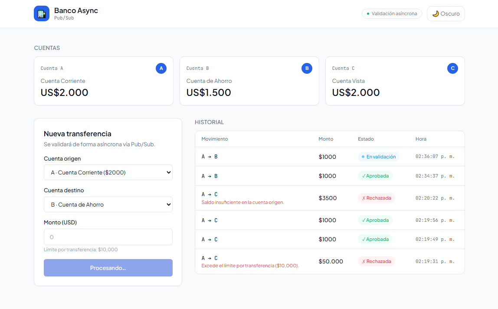
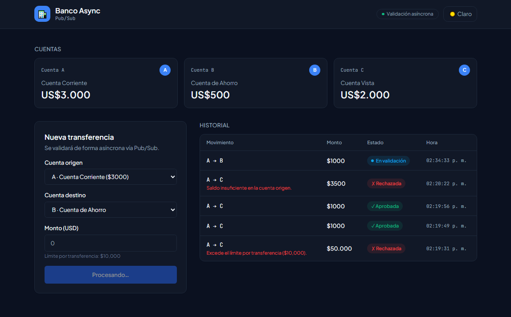
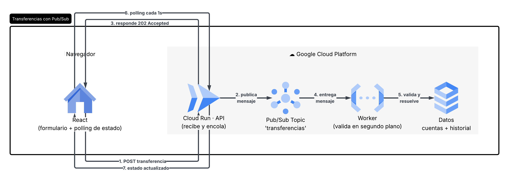
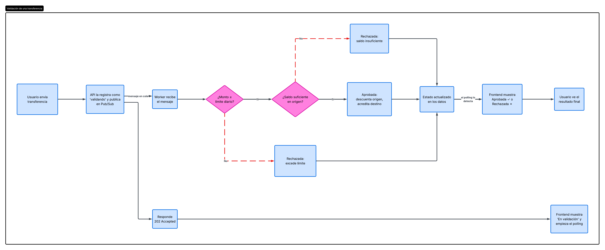
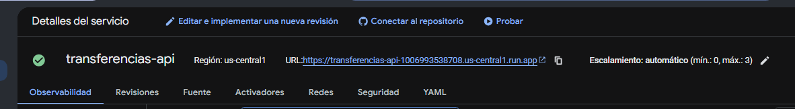
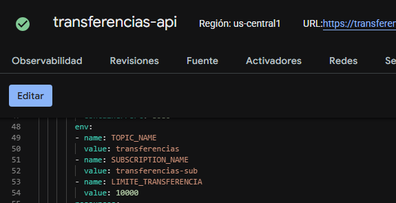
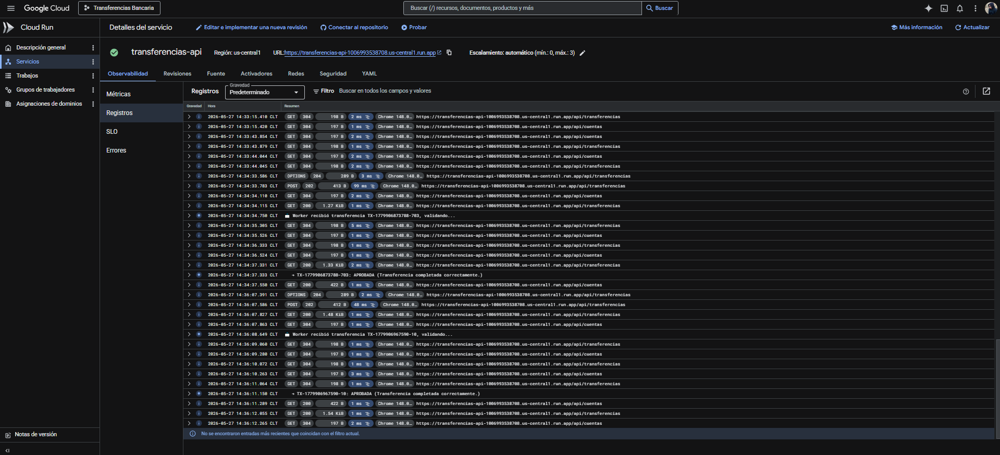
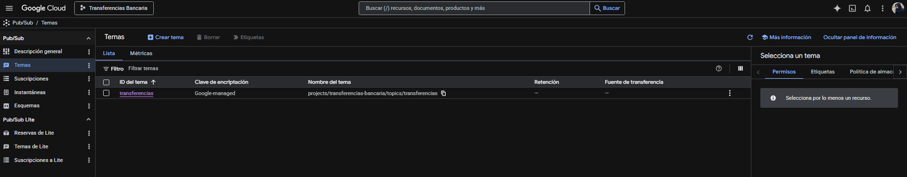
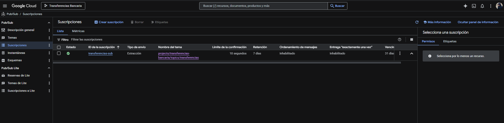
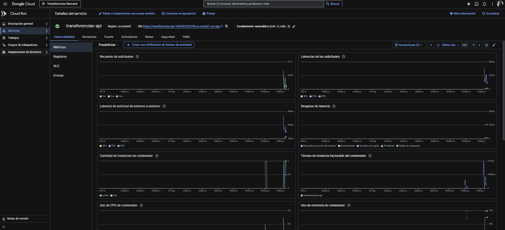

# Banco Async — Transferencias con Pub/Sub

Aplicación fullstack desplegada en producción. Frontend React que inicia transferencias bancarias procesadas de forma asíncrona mediante Google Cloud Pub/Sub, con validación en segundo plano por un worker y polling de estado en tiempo real.

---

## Vista previa

| Modo claro | Modo oscuro |
|-----------|-------------|
|  |  |

---

## ¿Qué hace?

Simula transferencias bancarias con validación asíncrona: el usuario inicia una transferencia, recibe un "en proceso" inmediato (202 Accepted), y un worker la valida en segundo plano verificando saldo y límites. El frontend muestra el estado moviéndose en vivo: `En validación → Aprobada ✓` o `Rechazada ✗`.

Los tres escenarios disponibles con las cuentas precargadas:
- **Aprobada** — saldo suficiente y monto dentro del límite de $10,000
- **Rechazada por saldo** — la cuenta origen no tiene fondos suficientes
- **Rechazada por límite** — el monto supera el límite por transferencia

---

## Stack

| Capa | Tecnología |
|------|-----------|
| Frontend | React 18 · Vite · Tailwind CSS |
| Backend (API) | Node.js 20 · Express |
| Mensajería | Google Cloud Pub/Sub |
| Worker | Node.js (suscriptor pull de Pub/Sub) |
| Cómputo | Google Cloud Run (serverless) |

---

## Arquitectura del sistema

La API no valida la transferencia — la encola. El worker la consume en segundo plano. Ese desacople permite que la API responda inmediatamente mientras la validación ocurre de forma independiente.



```
React → POST transferencia → Cloud Run API → publica en Pub/Sub → Worker valida
                          ↓                                              ↓
                    202 Accepted                              aprobada / rechazada
                          ↑                                              ↑
                    React polling cada 1s ←──────────────────────────────┘
```

---

## Flujo de una transferencia



---

## Evidencia de despliegue

### Servicio activo en Cloud Run

El servicio `transferencias-api` está activo en `us-central1` con escalamiento automático de 0 a 3 instancias.



### Variables de entorno del contenedor

Las tres variables se inyectan en el momento del despliegue. Ningún valor está hardcodeado en el código.



### Logs en producción

Los logs muestran el flujo asíncrono completo:

- `POST 202 /api/transferencias` — transferencia recibida y encolada en Pub/Sub.
- `📨 Worker recibió transferencia TX-..., validando...` — el worker consume el mensaje.
- `→ TX-...: APROBADA / RECHAZADA` — resultado de la validación en segundo plano.



### Pub/Sub — Topic y Suscripción

El topic `transferencias` recibe los mensajes de la API. La suscripción pull `transferencias-sub` los entrega al worker dentro del mismo contenedor.





### Métricas del servicio



---

## Estructura

```
03-transferencias/
├── backend/
│   ├── index.js                  API + arranca el worker
│   ├── Dockerfile
│   └── src/
│       ├── config/pubsub.js      Cliente Pub/Sub + variables de entorno
│       ├── data/store.js         Cuentas y transferencias en memoria
│       ├── controllers/          Publica en Pub/Sub, responde 202
│       ├── routes/
│       └── worker/
│           ├── worker.js         Suscriptor pull de Pub/Sub
│           └── validador.js      Reglas de negocio (saldo, límite)
├── frontend/
│   └── src/
│       ├── hooks/useBanco.js     Estado global + polling del resultado
│       ├── services/api.js       Comunicación con la API
│       └── components/
│           ├── PanelCuentas.jsx
│           ├── FormularioTransferencia.jsx
│           └── Historial.jsx
└── diagramas/
    ├── arquitectura.md
    └── flujo.md
```

---

## Correr en local

**Backend**
```bash
cd backend
npm install
gcloud auth application-default login
gcloud auth application-default set-quota-project transferencias-bancaria
cp .env.example .env   # ajusta los valores si es necesario
npm run dev            # http://localhost:8080
```

**Frontend**
```bash
cd frontend
npm install
npm run dev            # http://localhost:5173
```

---

## Despliegue en Cloud Run

```bash
cd backend
gcloud run deploy transferencias-api \
  --source . \
  --region us-central1 \
  --allow-unauthenticated \
  --set-env-vars TOPIC_NAME=transferencias,SUBSCRIPTION_NAME=transferencias-sub,LIMITE_TRANSFERENCIA=10000
```

Requiere tener el topic y la suscripción creados previamente:

```bash
gcloud pubsub topics create transferencias
gcloud pubsub subscriptions create transferencias-sub --topic transferencias
```

---

## Endpoints de la API

| Método | Ruta | Acción | Código |
|--------|------|--------|--------|
| GET | `/api/cuentas` | Lista cuentas y saldos | 200 |
| GET | `/api/transferencias` | Historial completo | 200 |
| GET | `/api/transferencias/:id` | Estado de una transferencia | 200 |
| POST | `/api/transferencias` | Inicia una transferencia | **202** |
| GET | `/health` | Estado del servicio | 200 |

> El `202 Accepted` es semánticamente correcto para operaciones asíncronas: la solicitud fue recibida pero el procesamiento no ha terminado.

---

## Decisiones técnicas

- **202 Accepted en lugar de 201**: la transferencia fue recibida pero no validada. Responder 201 implicaría que el recurso ya está creado y resuelto, lo cual no es verdad.
- **Pub/Sub pull subscription**: el worker controla el ritmo de consumo. Una push subscription requeriría exponer un endpoint HTTP adicional para que Pub/Sub llame.
- **Worker en el mismo contenedor**: simplifica la demo. En producción sería un servicio separado para escalar API y worker de forma independiente.
- **Polling cada 1 segundo**: técnica simple y efectiva. La alternativa pro serían WebSockets o Server-Sent Events para evitar peticiones repetidas.
- **Datos en memoria**: los saldos y el historial se reinician al reiniciar el contenedor. Cloud Run puede hacer esto en cualquier momento. Es el comportamiento esperado para esta demo.
- **Sin credenciales en el código**: Application Default Credentials en local, cuenta de servicio propia de Cloud Run en producción con rol `pubsub.editor`.
